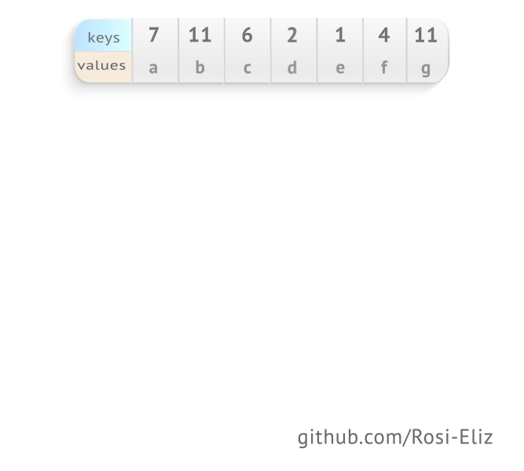
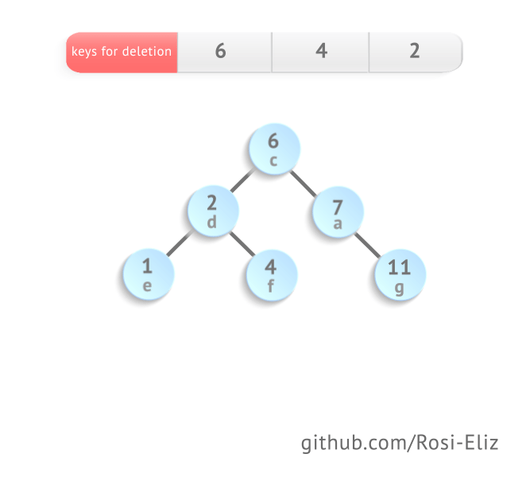
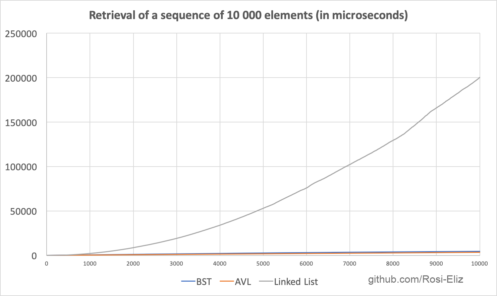
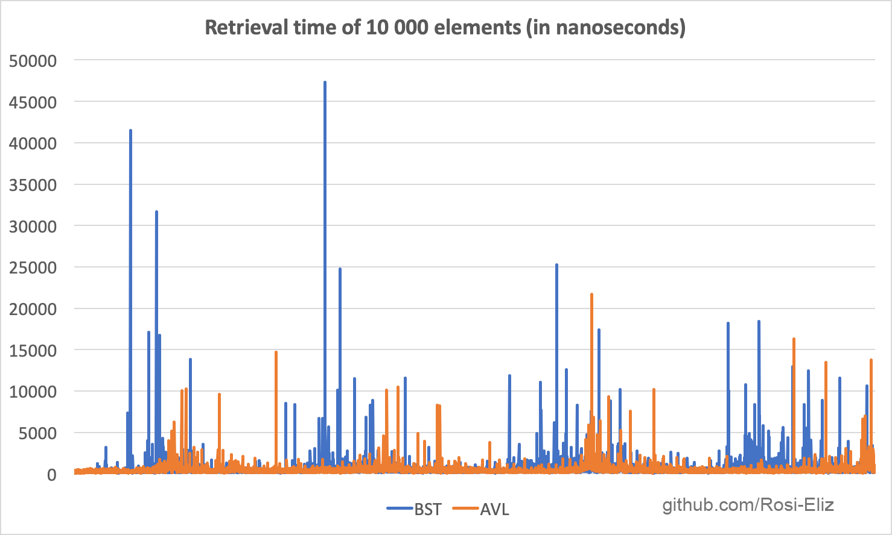
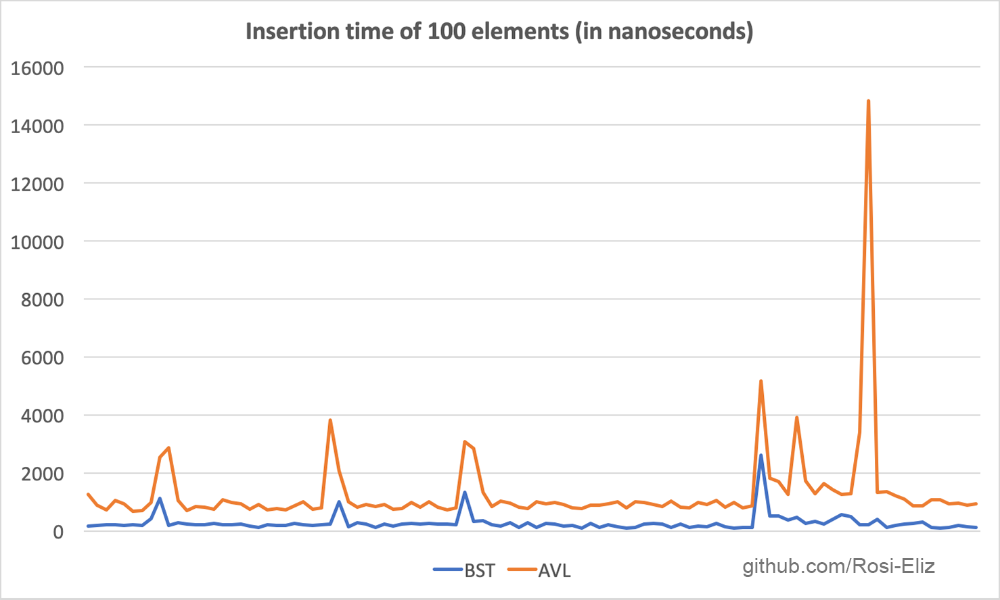
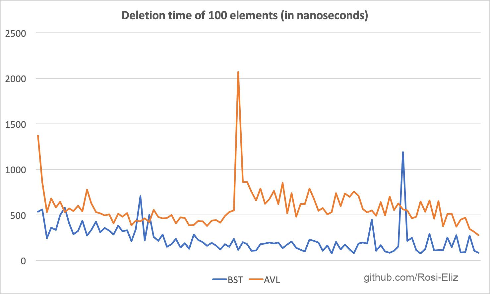
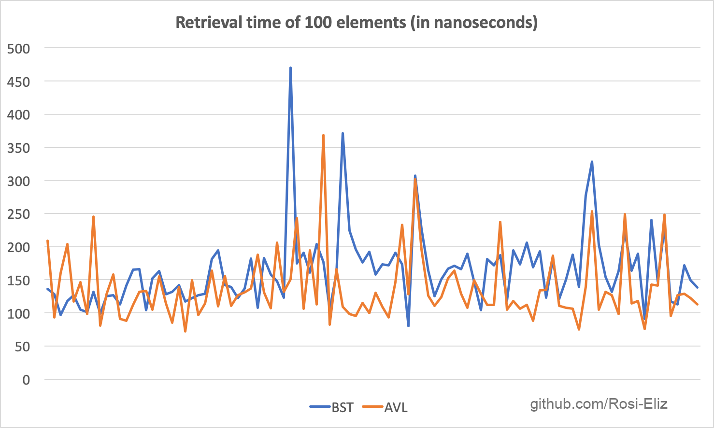

# AVL tree data structure

AVL tree is a self-balancing binary search tree for which each node maintains an additional quantitative value called a balance factor, whose value should either be -1, 0 or +1. The balance factor of a node represents the difference between the heights of the left and right subtrees of that node or vice-versa. If at any time the balance factor is different from the above mentioned values, rebalancing is done to restore this property. Lookup, insertion, and deletion all take O(log n) time in both the average and worst cases, where n is the number of nodes in the tree prior to the operation. Insertions and deletions may require the tree to be rebalanced by one or more tree rotations.

## Overview
The project provides an implementation of the avl tree data structure with all of its operations. Prior to using the data structure the key and value types should be specified. The key could be a predefined type, provided that it implements the `operator<` operator so that the key can be traversed through the tree in accordance to its value as compared to the visited node values.

## Usage

The AVL class is initialized with a template specifying the key and the value types of the constructed instance:
```C++
    AVL<int, char> avl({pair<int, char>(14, 'A'),
        pair<int, char>(17, 'B'),
        pair<int, char>(11, 'C'),
        pair<int, char>(7, 'D'),
        pair<int, char>(53, 'E'),
        pair<int, char>(4, 'F'),
        pair<int, char>(13, 'G'),
        pair<int, char>(12, 'H')});
```
The avl tree instance can be rendered in the console using the `print()` method. The output would be as follows:
```
        .---53|E
    .---17|B
---14|A
   |        .---13|G
   |    .---12|H
   |   |    `---11|C
    `---7|D
        `---4|F
```

## Insertion mechanism



## Deletion mechanism



## Performance

The diagrams below show the performance benefits of using the avl tree structure over the usage of linked lists and binary trees in terms of insertions, deletions and lookup of elements.






